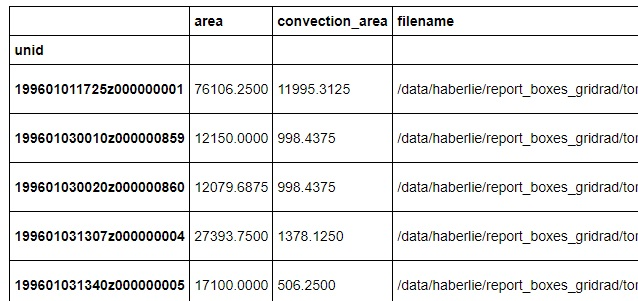
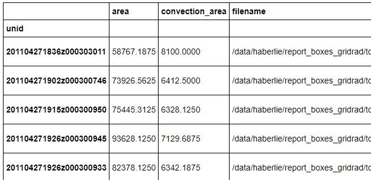
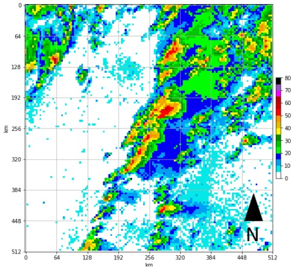

<h1><a href="http://nimbus.niu.edu/svrimg">SVRIMG - SeVere Reflectivity IMaGe Dataset</a></h1>
<h2>Radar Reflectivity Images Centered on Severe Weather Reports</h2>

[](https://codecov.io/github/ahaberlie/SVRIMG?branch=master)

Note: The SVRIMG interface is still extremely new, and is likely to change. Do not consider anything "stable".

<h2> Usage </h2>

Accessing the svrimg index table.  You can select 'tor', 'wind', or 'hail' for haz_type:

```
from svrimg.utils.get_tables import get_table

df_indexer = get_table(which='svrimg', haz_type='tor')
```



Subset the data as you wish.

```
df_subset = df_indexer[df_indexer.radar_time=='4/27/2011 19:00']
```



Then use the following code to download the images from your subset:

Note: "../data" is assumed to exist.  In the following example, a folder 
named 'tor' will be created in "../data".

```
from svrimg.utils.get_images import request_images

info = request_images(df_subset.index.values, haz_type='tor', data_dir="../data")
```

Which will give a dictionary output like:

```
{'201104271836z000303011': '../data/tor/2011/201104271836z000303011.png',
 '201104271902z000300746': '../data/tor/2011/201104271902z000300746.png',
 '201104271915z000300950': '../data/tor/2011/201104271915z000300950.png',
 '201104271926z000300945': '../data/tor/2011/201104271926z000300945.png',
 '201104271926z000300933': '../data/tor/2011/201104271926z000300933.png',
 '201104271928z000303012': '../data/tor/2011/201104271928z000303012.png'}
```

To view a single image, look up its uid in 'info' above:

```
from svrimg.utils.get_images import read_image

uid = "201104271836z000303011"
fname = info[uid]
```

And read in the file

```
im = read_image(fname)
```

You can then plot the file with a scale using the following code.

NOTE: If not using juptyer notebook, just remove '%matplotlib inline'

```
import matplotlib.pyplot as plt
from svrimg.mapping.map_helper import draw_box_plot
%matplotlib inline

ax = plt.subplot(1,1,1)
ax = draw_box_plot(ax, im)
```




More complex uses can be explored in the 'examples' folder!

<h3>Bulk downloads</h3>

If using the interface for more than just a handful of images, it may be useful to instead download the tar.gz files containing all of the images and placing these into your data folder:

https://svrimg.org/data/tars/

You may have to reorganize the files to work with the basic examples provided on this page (i.e., you have to move all of the files out of their monthly subfolders into a main "year" folder).


<h3>Dependencies</h3>
<p>These Python packages are required to run the base code in this repository.</p>
<lu>
<li>numpy</li>
<li>matplotlib</li>
<li>pandas</li>
<li>xarray</li>
<li>imageio</li>
</ul>
</p>
<p>These Python packages are suggested to run the jupyter notebook examples.</p>
<lu>
<li>jupyter notebook</li>
<li>scipy</li>
<li>scikit-learn</li>
<li>keras</li>
<li>tensorflow / keras</li>
<li>cartopy</li>
</ul>
</p>

<p>Copy and paste the following command into anaconda python command prompt with your environment activated and in the SVRIMG project folder to install the basic requirements.</a>

```
pip install -r minimum_requirements.txt
```

<h3>Installing SVRIMG</h3>
<p>

1) clone the repository (git or GUI, either is fine)

2) activate environments and navigate to the project directory ("SVRIMG")

3) type the following ```pip install .```

4) you now can import ```svrimg``` in Python

</p>
<h3>Code Documentation</h3>
<p>
Coming soon!
</p>
<h3>Overview</h3>
<p>
The <a href="http://nimbus.niu.edu/svrimg">SVRIMG website</a> provides a "one stop shop" for over 500,000 data rich, geospatial, radar reflectivity images centered on high-impact weather events. 
These images have consistent dimensions and intensity values on a grid with relatively low spatial distortion over the Conterminous United States. So, they 
are perfect for training and validating machine learning models. Crowd-sourced labels will provide a consistent dataset on which to test model performance.
We also plan to provide pre-trained models, either generated from unlabeled (GAN) or labeled images.
The goal is to create a "model zoo" for a variety of applications and to promote competition to create the best model.</p>

<h3>Crowd-Sourced Classification</h3>
<p>
There is a phrase: "many hands make light work". This also applies to generating machine learning datasets.  If hundreds of people classify hundreds of images,
we can easily create a dataset of 10s of thousands of images. The process is similar to playing a video game on your phone.  After accessing the map on the website,
you can explore different tornado report locations and see what the radar image looked like at the time the tornado touched down.  Go to <a href="http://nimbus.niu.edu/svrimg">SVRIMG</a>
to examine the images and make your own classifications.</p>

<h3 class=>Data Methodology</h3>
<p>
Radar images are centered on <a href=https://www.spc.noaa.gov/wcm/#data>SPC severe weather reports</a> and extracted from the closest 
hourly data in <a href=http://gridrad.org/>GridRad</a> which can be downloaded from the <a href=https://rda.ucar.edu/datasets/ds841.0/>Research Data Archive</a>.  
The original ~2x2km 3D data are converted to 2D by calculating the column maximum reflectivity.  These values are then converted to 8-bit integers and interpolated 
to a 3.75 km <a href="http://nimbus.niu.edu/svrimg/maps/svrimg_geog.nc">Lambert Conic Conformal Grid</a> using nearest neighbor. The 136 x 136 dimensions result in a region approximately 512 x 512 km.
Please view the <a href="http://nimbus.niu.edu/svrimg/raw_data.html">data information page</a> for more information and to download the raw data.
</p>

<h3>Data Citations</h3>
<p>We are generating these data solely because we think they would be of interest to the meteorology and 
climatology community. That being said, we would like to get some credit if you find them useful! 

<p><h4>If using these data in a paper or project, please cite the methods paper:</h4></p>
<p>Haberlie, A. M., W. S. Ashley, and M. Karpinski, 2020: Mean storms: 
   Composites of radar reflectivity images during two decades of severe thunderstorm events. International Journal of Climatology, In Press.
</p>
<p><h4>Please cite the GridRad dataset as well:</h4></p>
<p>Bowman, K. P., and C. R. Homeyer. 2017. GridRad - Three-Dimensional Gridded NEXRAD WSR-88D Radar Data. 
   Research Data Archive at the National Center for Atmospheric Research, Computational and Information Systems Laboratory. Accessed dd mmm yyyy.</p> 
   
<h3>Data Analysis</h3>
<p>
Use the notebook examples and utilities to turn your classifications, or the raw data, into your own analyses. This repo provides continually updated ways to work with the data.</p>   
   
<p><h4>Funding Sources:</h4></p>
<p>Louisiana Board of Regents RCS Grant LEQSF(2019-22)-RD-A-07</p>
<p>National Science Foundation Grant ATM-1637225</p>
<p>NOAA Grant NA13OAR4310183.</p>
